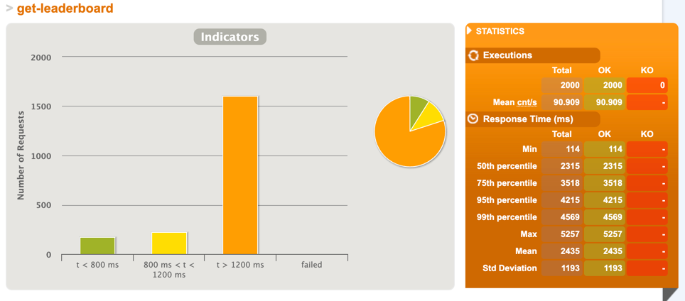

# Spring Microservice Demo

The intention of this demo is to demonstrate building a scalable Microservice using the latest Spring features and best practices.

Demo API for a simple casino allowing:

* CRUD operations for Players
* Managing wallet for Players
* Playing a game
* Retrieving Leaderboard

### Implementation Decisions
* **Performance Measuring Test With Gatling**
  * This allows us to quickly measure the performance improvements when making changes to the API
  * The [PlayerRequestSimulation.java](src%2Ftest%2Fjava%2Fgatling%2Fsimulation%2FPlayerRequestSimulation.java) runs random simulations of the most important endpoints and Gatling generates a report that we can use to measure endpoint latencies 
* [**Spring Webflux**](https://docs.spring.io/spring-framework/reference/web/webflux.html) 
  * The Reactive Web Framework was applied to frequently used endpoints - This allows for exposing fully non-blocking endpoints hence allowing the system to operate using less threads. Note that we are able to use the reactive as well as non-reactive framework side by side.
  * Backpressure - this also allows the individual endpoints to control back pressure should more events be produced than the system can handle. This means that the consumer side is able to decide whether tp buffer, drop or fail the excess events
  * Note that applying this change to an existing non-reactive API does require significant changes throughout, mainly in converting method return types to use Mono or Flux 
* **Reactive Mongo Repository**
  * This allows for non-blocking database calls
  * The change from the non-reactive repository is pretty much seamless
  * Note that in this API both ReactiveMongoRepository and ReactiveMongoTemplate are used. ReactiveMongoRepository is normally used when the default repository methods are enough. However, in cases where you would like more control in defining a query, ReactiveMongoTemplate is required. 
  * **Handling Concurrency**
    * If multiple nodes of the app are running, we can expect that more than one node can make changes to the database concurrently. This may lead to undesired consequences, especially in scenarios that require two or more DB interactions.
    * One approach used to handle this when updating a Player was to use the ReactiveMongoTemplate findAndModify() method as opposed to fetching then updating the player which may lead to concurrency issues (since findAndModify performs 2 operations simultaneously)
* **Leaderboard**
  * For this demo, the leaderboard is implemented using strong consistency, meaning that each time a query for the leaderboard is received, we serve the latest version of the data, hence no stale data
  * In order to serve this data reasonably quickly we have decided to use Reactive Mongo and Mongo Aggregates on a single collection to serve this data
  * However, if the applications traffic increases, this feature is a good candidate to be converted to an eventually consistent endpoint using event sourcing and CQRS (for instance by using the [Axon framework](https://github.com/gabrieldimech/event-sourcing-axon-spring-boot-mongo)) - this way the game result outcomes may be processed individually and update the leaderboard status in the state of the application on the fly, hence each time a request for this data arrives we simply serve this rather than calculate it from scratch. Some other solutions are described [here](https://blog.stackademic.com/leaderboard-using-spring-boot-and-relational-database-3c10e879b17d)
  * The leaderboard is only updated when a player wins a bet, hence by caching the leaderboard we're able to save on some calls to calculate this.

In order to demonstrate the incremental performance improvements, below are a number of changes made sequentially and each time the same test is executed. The results from the leaderboard endpoint are demonstrated in each case. Note that the tests done below are only intended to get an understanding on whether there have been signs of performance improvements and further testing should be done in order to draw conclusions.

### Step 1 - Add Caching

Note that the average latency for retrieving leaderboard data reduced from ≈ **2.4** to ≈ **1.7** seconds after using the cache:

No Cache             |  Cached
:-------------------------:|:-------------------------:
 | 

### Step 2 - Add Webflux

Note that the average latency for retrieving leaderboard data reduced from ≈ **1.7** to ≈ **1.5** seconds after using Webflux:

Cached             |  Cached + Webflux 
:-------------------------:|:-------------------------:
 | 

### Step 3 - Add Reactive Mongo Repository

Note that the average latency for retrieving leaderboard data reduced from ≈ **1.7** to ≈ **0.6** seconds after using reactive mongo:

Cached + Webflux              |  Cached + Webflux + Reactive Mongo
:-------------------------:|:-------------------------:
 | 

### Future Work 
* Test migrating all DB calls from ReactiveMongoRepository to ReactiveMongoTemplate to compare performance
* Test Java 21 Virtual threads
* Investigate Mongo indexes
* Add DB data version field for concurrent reads/writes
* Dockerize the app
* Run multiple nodes with kubernetes + load balancing
* Add Spring actuator for monitoring
* Add Spring Security
* Add Integration tests
* Add Property tests
* Add Config server